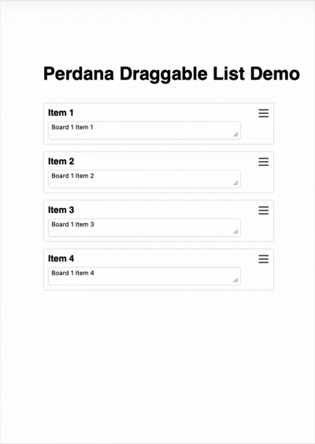

# Perdana Draggable List

React drag-and-drop list with a grab handle and automatic sizing for variable-height cards.

## Demo



## Features
- Drag to reorder by clicking a handle (no full-card drag conflicts with inputs).
- Cards resize to their content; drop targets respect real heights.
- Minimal API with render callbacks for full custom layouts.
- Lightweight: a single component and a small CSS footprint.

## Installation
```bash
npm install perdana-draggable-list
```
> Requires React 18+ (tested with React 18/19). Ensure your bundler supports CSS imports from JS.

## Quick start
```jsx
import React, { useState } from "react";
import PerdanaDraggableList from "perdana-draggable-list";

const initial = [
  { id: "item-1", title: "First", description: "A short note" },
  { id: "item-2", title: "Second", description: "A longer note\nwith multiple lines" },
];

export default function Example() {
  const [items, setItems] = useState(initial);

  return (
    <PerdanaDraggableList
      data={items}
      gap={12}
      onDragEnd={(_, __, next) => setItems(next)}
      renderItem={(index, item) => (
        <div style={{ display: "flex", flexDirection: "column", gap: 6 }}>
          <strong>{item.title}</strong>
          <textarea
            value={item.description}
            onChange={(e) => {
              const next = [...items];
              next[index].description = e.target.value;
              setItems(next);
            }}
          />
        </div>
      )}
    />
  );
}
```

## Props
| Prop | Type | Default | Description |
| --- | --- | --- | --- |
| `data` | `Array<{ id: string, ... }>` | **required** | Items to render; each item needs a unique `id`. |
| `gap` | `number` | `12` | Vertical gap between cards (px). |
| `onDragStart` | `(startIndex: number) => void` | — | Called when a drag begins. |
| `onDragEnd` | `(start: number, end: number, nextData: Array) => void` | — | Called when a drag ends; `nextData` is the reordered list. |
| `renderItem` | `(index: number, item: any) => ReactNode` | default renderer | Custom card content. Receives the item and its current index. |
| `renderHandleIcon` | `() => ReactElement` | burger icon | Custom grab handle icon element. |
| `containerClassName` | `string` | `""` | Extra class for the container. |
| `cardItemClassName` | `string` | `""` | Extra class for each card. |

## Styling hooks
- Root: `.pg-board-container`
- Card: `.pg-card` (active state: `.pg-card.pg-card-active`)
- Grab handle: `.pg-grab-btn` (active state: `.pg-grab-btn.pg-grab-btn-active`)
- Default content styles: `.pg-card-title`, `.pg-card-wrapper`

Override these in your own CSS or pass `containerClassName` / `cardItemClassName` to attach your classes. The component imports its base CSS; include it (or copy the rules) in your app’s bundle.

## Notes
- The component measures card heights after render, so dynamic content (inputs, text areas) will still drop correctly.
- Dragging is handle-only to avoid fighting with form controls inside cards. Use `renderHandleIcon` to swap the icon if needed.
